<h1 align="center">Hi, I'm Jaime Cristian 👋</h1>

  

  
  

---

## 👨‍💻 About Me

💻 Software Engineer with 4+ years of professional experience building and maintaining enterprise applications.

🚀 Specialized in **C#, .NET, ASP.NET Core, REST APIs, and SQL Server**.

☁️ Experience with **Microsoft Azure, GitHub, CI/CD, and enterprise development environments**.

🔧 Currently expanding my backend development skills with **Go, React, TypeScript, Docker, and cloud technologies**.

🏗️ Interested in **Software Architecture, Clean Architecture, CQRS, API Design, Cloud, and scalable backend systems**.

🌎 Based in **Mexico City Metropolitan Area, Mexico**.

---

## 🛠️ Tech Stack

### 💻 Languages

  
  
  
  
  

### ⚙️ Backend

  
  
  
  
  
  

### 🎨 Frontend

  
  
  
  
  

### 🗄️ Databases

  
  

### ☁️ Cloud & DevOps

  
  
  
  
  

---

## 🏗️ Architecture & Engineering

  
  
  
  
  
  
  

---

## 🚀 Featured Projects

### 🧮 Calculator App

**Go + React + TypeScript + Docker + Azure**

Full-stack calculator application with a Go REST API and React/TypeScript frontend.

- REST API
- Input validation
- Structured error handling
- Unit testing
- Docker Compose
- Azure Container Apps

  

---

### ☕ Starbucks API

**ASP.NET Core + Clean Architecture + CQRS**

Backend API focused on separation of concerns, maintainability, and scalable application design.

- Clean Architecture
- CQRS
- Custom mediator-based request handling
- Entity Framework Core
- JWT Authentication
- FluentValidation
- AutoMapper

  

---

## 📊 GitHub Stats

  
  

---

## 🔥 GitHub Streak

  

---

## 🐍 Contributions

  

---

## 🌐 Connect With Me

  
  

  ⭐ Thanks for visiting my profile!

